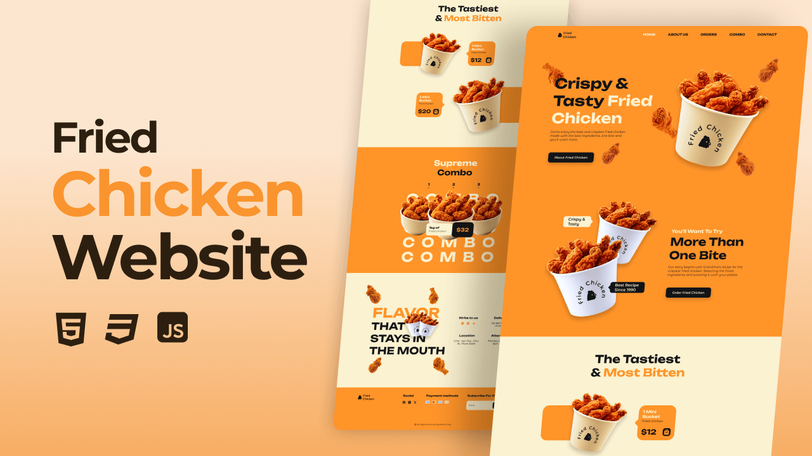

# Responsive Fried Chicken Website

This is a visually engaging web project showcasing an eye-catching fried chicken-themed layout, designed to adapt seamlessly across devices (desktop, tablet, mobile). It comes complete with interactive elements, custom styling, and a clean, intuitive user interface.

**Live Website:** [https://kethnulee-weerasinghe.github.io/Responsive-Fried-Chicken-Website/](https://kethnulee-weerasinghe.github.io/Responsive-Fried-Chicken-Website/)



## Overview

This is a **responsive, static restaurant / menu website** that highlights fried chicken offerings. It includes sections like Home, About, Order, Combo, Contact, and a footer. Animations and scroll interactions are included for a dynamic user experience. The layout adjusts smoothly across desktop, tablet, and mobile screen sizes.  

- Fully responsive layout across different devices  
- Scroll-based animations (e.g. elements reveal on scroll)  
- “Active” navigation highlight as you scroll through sections  
- Smooth transitions and visual polish  
- Clean UI/UX suited to food / restaurant branding  

## Technologies

- HTML
- CSS
- JavaScript

## Running Locally

To view or edit the project locally:

```bash
git clone https://github.com/Kethnulee-Weerasinghe/Responsive-Fried-Chicken-Website.git
cd Responsive-Fried-Chicken-Website
